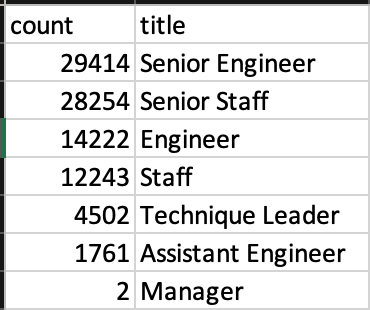
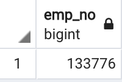
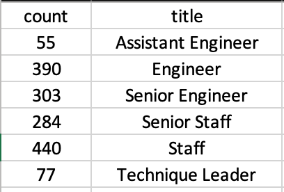

# Pewlett-Hackard-Analysis

## Overview of the analysis: Explain the purpose of this analysis.
The purpose of this analysis was to determine the number of retiring employees per title, and identify employees who are eligible to participate in a mentorship program to help the company, Hewlett Packard, prepare for the large number of employees reaching retirement eligibility. 

## Results: Provide a bulleted list with four major points from the two analysis deliverables. Use images as support where needed.

- From the analysis we can see that 29,914 Senior Engineers, and 28,254 Senior Staff will be eligible to retire. Also  14,222 Engineers and Staff 12,243 employees will be eligible for retirement. 

- We were able to create a list of employees that are eligible for a new mentorship program to help the company in this large transition and coach existing employees for department advancement. There are a total of 1,549 employees who fit the criteria of being born between Jan 1, 1965 to Dec 31, 1965.

## Summary: Provide high-level responses to the following questions, then provide two additional queries or tables that may provide more insight into the upcoming "silver tsunami."
How many roles will need to be filled as the "silver tsunami" begins to make an impact?
Are there enough qualified, retirement-ready employees in the departments to mentor the next generation of Pewlett Hackard employees?
There are 133,776 employees that are eligible for retirement soon. 

You can see the breakdown of the number of employees that can be part of the retirement mentorship plan by department.

Based on the tables shown, there are no managers who are eligible for the mentorship program but 2 manager who will retire soon. Everyother role has over a thousand more employees retiring than employees who are able to train new department leaders. This is a huge gap in available resources to help alleviate the coming wave of employees who will be transitioning out therefore I suggest widing the perameters of who can mentor other employees or develop a traning course for larger groups of employees to be able to be promoted.
